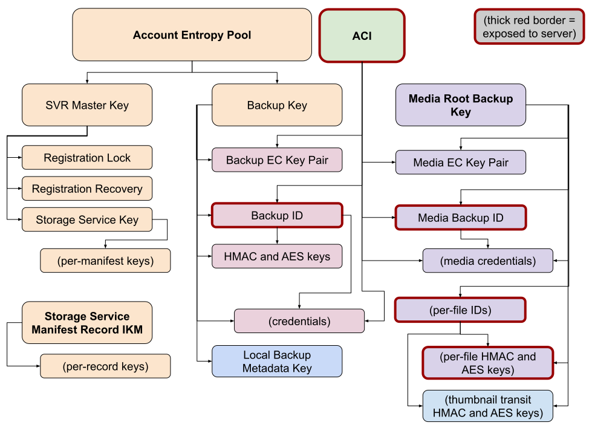

# Backups

libsignal has a handful of APIs related to backups:

- [Account keys](#account-keys)
- [Backup validation](#backup-validation)
- [BackupAuthCredential](#backupauthcredential)

## Account keys

Going forward, a number of account keys, including backup keys, will be derived from an *account entropy pool,* a 64-character alphanumeric ASCII string. While the AEP is represented as a plain String in libsignal APIs, methods to work with it can be found on `AccountEntropyPool`, including generation, validation, and derivation of other keys.

Derived from the account entropy pool is the `BackupKey`, a strongly-typed 32-byte blob that is used for all aspects of backups. There are many keys and identifiers that are derivable from a BackupKey.

Finally, the key specifically used to encrypt backup files is the `MessageBackupKey`, another strongly-typed object that consists of an HMAC key and an AES key for signing and encrypting the backup, respectively.




## Backup validation

There are a few different APIs that work with backup files:

### MessageBackup: Bulk validation of an encrypted backup file stream

Takes in an encrypted input stream and produces validation results. Hard errors are thrown as exceptions, soft errors (unknown fields) are returned for manual checking or logging.

Validation makes two passes over the stream to verify its contained MAC both before and after parsing, so the relevant APIs take a callback to *produce* streams rather than a single stream object. There is no guarantee that the first stream has been fully consumed before the second is produced, so do not reuse the same stream object.

Provided by:

- `MessageBackup` in Java
- `validateMessageBackup` in Swift
- `validate` in the `MessageBackup` module in TypeScript


### OnlineBackupValidator: Validation of a backup as it's being made

Feed frames into the validator to check them one by one, but don't forget to finalize the backup (`close` in Java, `finalize` in Swift and TypeScript) to run the end-of-file checks!

This is usually going to be faster than the bulk validation because it skips the decryption and decompression steps, but of course this also means the encryption and compression of the backup being created aren't tested.

Only logs soft errors rather than returning them in a manipulatable form.


### ComparableBackup: "Canonicalization" of a backup for testing purposes

Takes an **unencrypted** backup as input and produces a JSON string as output, which can be formatted and diffed as JSON or just line-by-line. Don't forget to check for any unknown fields that get reported as well; they won't be included in the JSON and could invalidate any comparison.

Note that this format should not be considered stable (i.e. don't persist it or try to parse it). It's only intended for comparing two backups to each other; the usual way this is used is for an app to import Backup A and then immediately export its data as Backup B, then verify that the results are identical.


## BackupAuthCredential

The BackupAuthCredential types follow the usual zkgroup construction from the client's perspective, similar to the other AuthCredential variants:

```pseudocode
let requestContext = BackupAuthCredentialRequestContext.create(backupKey, aci)
let httpResponse = goRequestBackupAuthCredentialsFromServer(requestContext.getRequest())
for each response in httpResponse {
    let expectedRedemptionTime = start of each day
    let credential = requestContext.receive(response, expectedRedemptionTime, serverParams)
    log(credential.backupLevel, credential.type)
    goSaveCredential(credential, expectedRedemptionTime)
}
```

```pseudocode
let presentation = credential.present(serverParams)
goDoSomeBackupOperation(presentation)
```

More information on these credentials in the client/server docs.
