# Overview

The Rust project is structured in several crates, with the README.md at the
root of the repository providing a quick explanation of the purpose of each
of these crates.

Below is a Mermaid diagram showing the dependency chain of these crates.
Right now, `mdbook` does not render this diagram, but you can view it in the
[GitHub web view](https://github.com/signalapp/libsignal/blob/main/doc/src/overview/README.md) instead.

```mermaid
graph TD;
    libsignal-account-keys --> libsignal-core;
    libsignal-account-keys --> signal-crypto;
    libsignal-ffi --> libsignal-bridge;
    libsignal-ffi --> libsignal-bridge-macros;
    libsignal-ffi --> libsignal-bridge-testing;
    libsignal-ffi --> libsignal-core;
    libsignal-ffi --> libsignal-net;
    libsignal-ffi --> libsignal-net-chat;
    libsignal-ffi --> libsignal-protocol;
    libsignal-ffi --> signal-media;
    libsignal-jni --> libsignal-debug;
    libsignal-jni --> libsignal-jni-impl;
    libsignal-jni-impl --> libsignal-bridge;
    libsignal-jni-impl --> libsignal-core;
    libsignal-jni-impl --> libsignal-protocol;
    libsignal-jni-impl --> signal-crypto;
    libsignal-jni-testing --> libsignal-bridge-testing;
    libsignal-jni-testing --> libsignal-bridge-types;
    libsignal-jni-testing --> libsignal-jni-impl;
    libsignal-node --> libsignal-bridge;
    libsignal-node --> libsignal-bridge-macros;
    libsignal-node --> libsignal-bridge-testing;
    libsignal-node --> libsignal-protocol;
    signal-neon-futures-tests --> signal-neon-futures;
    libsignal-bridge --> attest;
    libsignal-bridge --> device-transfer;
    libsignal-bridge --> libsignal-account-keys;
    libsignal-bridge --> libsignal-bridge-macros;
    libsignal-bridge --> libsignal-bridge-types;
    libsignal-bridge --> libsignal-core;
    libsignal-bridge --> libsignal-debug;
    libsignal-bridge --> libsignal-keytrans;
    libsignal-bridge --> libsignal-message-backup;
    libsignal-bridge --> libsignal-net;
    libsignal-bridge --> libsignal-net-chat;
    libsignal-bridge --> libsignal-protocol;
    libsignal-bridge --> signal-crypto;
    libsignal-bridge --> signal-media;
    libsignal-bridge --> usernames;
    libsignal-bridge --> zkgroup;
    libsignal-bridge-testing --> attest;
    libsignal-bridge-testing --> libsignal-bridge-macros;
    libsignal-bridge-testing --> libsignal-bridge-types;
    libsignal-bridge-testing --> libsignal-core;
    libsignal-bridge-testing --> libsignal-debug;
    libsignal-bridge-testing --> libsignal-keytrans;
    libsignal-bridge-testing --> libsignal-message-backup;
    libsignal-bridge-testing --> libsignal-net;
    libsignal-bridge-testing --> libsignal-net-chat;
    libsignal-bridge-testing --> libsignal-protocol;
    libsignal-bridge-testing --> zkgroup;
    libsignal-bridge-types --> attest;
    libsignal-bridge-types --> device-transfer;
    libsignal-bridge-types --> libsignal-account-keys;
    libsignal-bridge-types --> libsignal-bridge-macros;
    libsignal-bridge-types --> libsignal-core;
    libsignal-bridge-types --> libsignal-debug;
    libsignal-bridge-types --> libsignal-keytrans;
    libsignal-bridge-types --> libsignal-message-backup;
    libsignal-bridge-types --> libsignal-net;
    libsignal-bridge-types --> libsignal-net-chat;
    libsignal-bridge-types --> libsignal-protocol;
    libsignal-bridge-types --> libsignal-svrb;
    libsignal-bridge-types --> signal-crypto;
    libsignal-bridge-types --> signal-media;
    libsignal-bridge-types --> signal-neon-futures;
    libsignal-bridge-types --> usernames;
    libsignal-bridge-types --> zkgroup;
    libsignal-cli-utils --> libsignal-core;
    libsignal-core --> libsignal-debug;
    signal-crypto --> libsignal-core;
    signal-crypto --> libsignal-debug;
    libsignal-message-backup --> libsignal-account-keys;
    libsignal-message-backup --> libsignal-core;
    libsignal-message-backup --> libsignal-message-backup-macros;
    libsignal-message-backup --> libsignal-protocol;
    libsignal-message-backup --> libsignal-svrb;
    libsignal-message-backup --> signal-crypto;
    libsignal-message-backup --> usernames;
    libsignal-message-backup --> zkcredential;
    libsignal-message-backup --> zkgroup;
    libsignal-net --> attest;
    libsignal-net --> libsignal-account-keys;
    libsignal-net --> libsignal-core;
    libsignal-net --> libsignal-keytrans;
    libsignal-net --> libsignal-net-infra;
    libsignal-net --> libsignal-protocol;
    libsignal-net --> libsignal-svrb;
    libsignal-net --> signal-crypto;
    libsignal-net-infra --> attest;
    libsignal-net-infra --> libsignal-core;
    libsignal-net-chat --> libsignal-core;
    libsignal-net-chat --> libsignal-keytrans;
    libsignal-net-chat --> libsignal-net;
    libsignal-net-chat --> libsignal-net-grpc;
    libsignal-net-chat --> libsignal-protocol;
    libsignal-net-chat --> usernames;
    libsignal-net-chat --> zkgroup;
    libsignal-net-grpc --> libsignal-core;
    libsignal-net-infra --> attest;
    libsignal-net-infra --> libsignal-core;
    libsignal-protocol --> libsignal-core;
    libsignal-protocol --> libsignal-debug;
    libsignal-protocol --> signal-crypto;
    libsignal-protocol-test-support --> libsignal-protocol;
    libsignal-protocol --> libsignal-core;
    libsignal-protocol --> libsignal-debug;
    libsignal-protocol --> signal-crypto;
    libsignal-svrb --> signal-crypto;
    usernames --> poksho;
    usernames --> signal-crypto;
    zkcredential --> poksho;
    zkgroup --> libsignal-account-keys;
    zkgroup --> libsignal-core;
    zkgroup --> poksho;
    zkgroup --> zkcredential;
```

